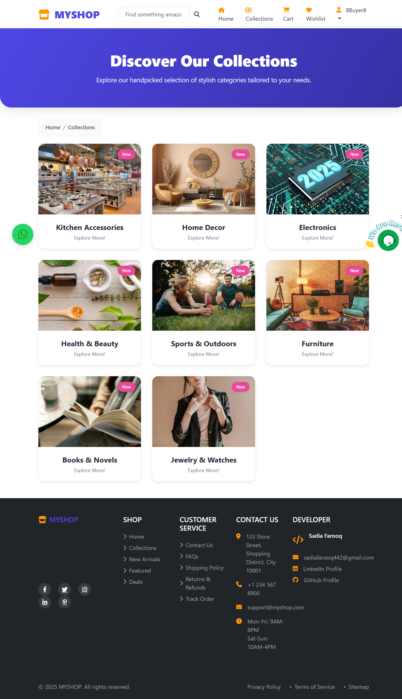

# Django-Multi-Vendor-E-commerce-Website
E-Shop is a full-featured e-commerce platform built with Django. It supports both Buyers and Sellers, with dashboards, invoices, real-time communication, and a clean UI.

 ## Table of Contents
 
 * 🔐 Authentication & Roles
 
 * 🧍 Buyer Features

 * 🧑‍💼 Seller Features

 * 🛠️ Admin Panel

 * 📄 Invoice System

 * 💬 Real-Time Communication

 ## Authentication & Roles
 
* Custom registration for Buyers and Sellers

* Role-based redirects after login

* Sellers must be approved by Admin

* Flash messages on login, logout, and registration

##  Buyer Features

* 🛍️ Browse products by category

* 🔍 Search and filter items

* ❤️ Add to wishlist

* 🛒 Add to cart and manage it

* 💰 Checkout with COD, Razorpay, or PayPal

* 📦 Track order status

* 📥 Download invoices as PDF

* 👀 View product details with seller info

* 💬 Chat with sellers via WhatsApp or Tawk.to

##  Seller Features

* 🏠 Seller dashboard after Admin approval

* ➕ Add products (name, price, image, etc.)

* ✏️ Edit or delete their own products

* 📦 View orders for their products

* 🔄 Update order status: Pending → Out for Delivery → Delivered

*📊 Optional analytics dashboard

* ⛔ Cannot access buyer features

⚠️ Unapproved sellers see a limited dashboard with a pending approval notice.

## Admin Panel

* ✅ Approve or reject seller registrations

* 👁️ View all buyers and sellers

* 📊 Platform stats: total products, orders, users

* 🔍 View seller details:

       * Product listings

       * Order history

       * Buyers who ordered from them

* 🗂️ Manage categories and products

* 🔐 Superuser-protected

## Invoice System

* PDF invoices with Order info (tracking, buyer, date), Total cost summary
* Downloadable from order details page

## Real-Time Communication

* WhatsApp support links (seller-buyer communication)
* Embedded Tawk.to live chat widget

## ScreenShots
### 

.png)

 - Copy.png)

