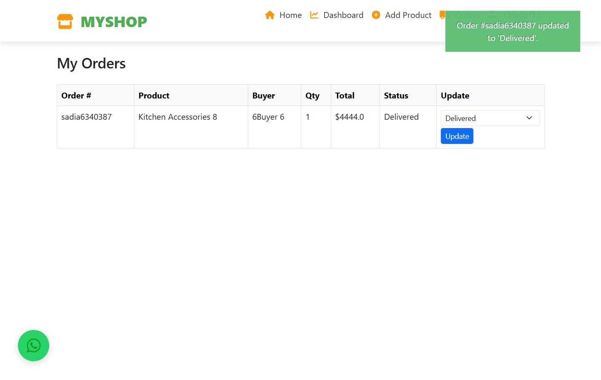

# Django-Multi-Vendor-E-commerce-Website
E-Shop is a full-featured e-commerce platform built with Django. It supports both Buyers and Sellers, with dashboards, invoices, real-time communication, and a clean UI.

 ## Table of Contents
 
 * Authentication & Roles
 
 *  Buyer Features

 *  Seller Features

 *  Admin Panel

 *  Invoice System

 *  Real-Time Communication

 ## Authentication & Roles
 
* Custom registration for Buyers and Sellers

* Role-based redirects after login

* Sellers must be approved by Admin

* Flash messages on login, logout, and registration

##  Buyer Features

*  Browse products by category

*  Search and filter items

*  Add to wishlist

*  Add to cart and manage it

*  Checkout with COD, Razorpay, or PayPal

*  Track order status

*  Download invoices as PDF

*  View product details with seller info

*  Chat with sellers via WhatsApp or Tawk.to

##  Seller Features

*  Seller dashboard after Admin approval

*  Add products (name, price, image, etc.)

*  Edit or delete their own products

*  View orders for their products

*  Update order status: Pending → Out for Delivery → Delivered

* Optional analytics dashboard

*  Cannot access buyer features

⚠️ Unapproved sellers see a limited dashboard with a pending approval notice.

## Admin Panel

*  Approve or reject seller registrations

*  View all buyers and sellers

*  Platform stats: total products, orders, users

*  View seller details:

     * Product listings

     * Order history

     * Buyers who ordered from them

*  Manage categories and products

*  Superuser-protected

## Invoice System

* PDF invoices with Order info (tracking, buyer, date), Total cost summary
* Downloadable from order details page

## Real-Time Communication

* WhatsApp support links (seller-buyer communication)
* Embedded Tawk.to live chat widget

## ScreenShots

### Regiter Page

### Seller Dashboard

### Seller Home(Before Approval)

### Seller Orders

### Collection on Buyer Side

### Buyer Ad-to-Cart

### Buyer Wishlist

### Buyer Checkout

### AdminPanel Dashboard

### AdminPanel Approving Sellers

Any many more.
##  How to Install & Run the Project
### Clone:
       git clone https://github.com/Saddia149/Multi-Vendor-Ecommerce-Website-in-Django.git
       cd Multi-Vendor-Ecommerce-Website-in-Django

### Install Django and other dependencies:
       pip install django
       pip install django-jazzmin
       pip install WeasyPrint

### Migrate:
       python manage.py migrate

### SuperUser:
       python manage.py createsuperuser

###  Access Admin Panel:
       Visit: http://127.0.0.1:8000/admin

### Run Server:
       python manage.py runserver

